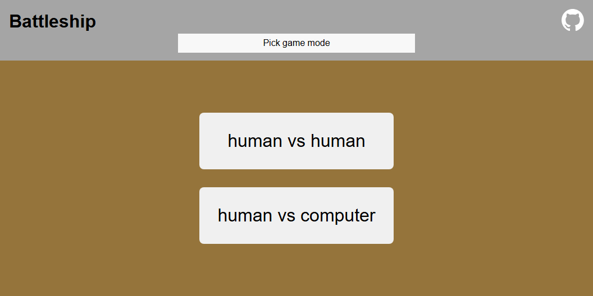
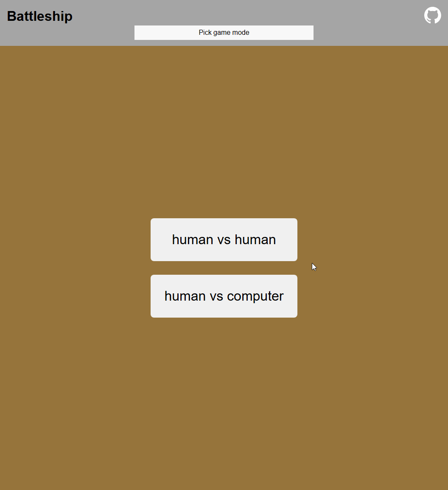

<!-- Improved compatibility of back to top link: See: https://github.com/othneildrew/Best-README-Template/pull/73 -->

<a name="readme-top"></a>

<!--
*** Thanks for checking out the Best-README-Template. If you have a suggestion
*** that would make this better, please fork the repo and create a pull request
*** or simply open an issue with the tag "enhancement".
*** Don't forget to give the project a star!
*** Thanks again! Now go create something AMAZING! :D
-->

<!-- PROJECT SHIELDS -->
<!--
*** I'm using markdown "reference style" links for readability.
*** Reference links are enclosed in brackets [ ] instead of parentheses ( ).
*** See the bottom of this document for the declaration of the reference variables
*** for contributors-url, forks-url, etc. This is an optional, concise syntax you may use.
*** https://www.markdownguide.org/basic-syntax/#reference-style-links
-->
<!-- [![Contributors][contributors-shield]][contributors-url] -->
<!-- [![Forks][forks-shield]][forks-url]
[![Stargazers][stars-shield]][stars-url]
[![Issues][issues-shield]][issues-url]
[![MIT License][license-shield]][license-url]
[![LinkedIn][linkedin-shield]][linkedin-url] -->

<!-- PROJECT LOGO -->
<br />
<div align="center">
  <a href="https://mikeycos.github.io/battleship">
    
  </a>

<h3 align="center">Battleship</h3>

  <p align="center">
    Inventory Application with CRUD methods and form validation.
    <br />
    <a href="https://mikeycos.github.io/battleship">Live Preview</a>
    ·
    <a href="./PROJECT_SPECIFICATIONS.md">Project Specifications</a>
    <!-- ·
    <a href="https://github.com/github_username/repo_name/issues/new?labels=bug&template=bug-report---.md">Report Bug</a>
    ·
    <a href="https://github.com/github_username/repo_name/issues/new?labels=enhancement&template=feature-request---.md">Request Feature</a> -->
    ·
    <a href="https://github.com/mikeyCos/battleship/blob/main/CHANGELOG.md">Changelog</a>
  </p>
</div>

<!-- TABLE OF CONTENTS -->
<details>
  <summary>Table of Contents</summary>
  <ol>
    <li>
      <a href="#about-the-project">About The Project</a>
      <ul>
        <li><a href="#built-with">Built With</a></li>
      </ul>
    </li>
    <li>
      <a href="#getting-started">Getting Started</a>
      <ul>
        <li><a href="#prerequisites">Prerequisites</a></li>
        <li><a href="#installation">Installation</a></li>
      </ul>
    </li>
    <li><a href="#usage">Usage</a></li>
    <li><a href="#roadmap">Roadmap</a></li>
    <!-- <li><a href="#contributing">Contributing</a></li>
    <li><a href="#contact">Contact</a></li> -->
    <li><a href="#acknowledgments">Acknowledgments</a></li>
    <li><a href="#questions">Questions</a></li>
  </ol>
</details>

<!-- ABOUT THE PROJECT -->

## About The Project

[![Battleship Screen Shot][product-screenshot]](https://mikeycos.github.io/battleship)

Project: Battleship

Hello world,

It has been a long time coming and I am pleased with the current state of the project. From creating Jest tests, to building the game logic, to testing, to 'connecting' a user interface with the game's logic, and implementing drag-drop functionality; this project is a behemoth.

Creating/implementing tests, figuring out what to test and how much to test was very uncomfortable. I am not too fond with testing, however, I know it is important. Testing helped lessen the worry if the game's logic will work when a user interface was implemented. There were a few cases where I needed to update some tests because of adding more parameters to functions; for example, adding parameters to the gameboard's `placeship` method to accommodate the implementation for drag/drop and the ability to rotate a ship.

The most time consuming and mind boggling part of this project involves translating the logic to a user interface. I resorted to what I was familiar with and used object literals to render, cache DOM elements and bind events. Initially, I planned the `screenController` module to fully control the user interface and the module quickly grew. I somewhat separated it's responsibility based on the current game's state; if `gameReady` is false, then only certain methods can or are activated. Unfortunately, once `gameReady` is true, it will have it's initial assigned methods and variables.

One of the most challenging implementations I somehow completed, the ability to drag and drop ships on a player's respective board. I tried using the built-in HTML drag and drop API, but I was not able to figure out how to drag a ship and keep the ship on or near a user's mouse cursor. Another complication I ran into, how do I communicate with the gameboard's `placeship`
a ship is still being dragged or a drop has happened? I needed to pass in boolean values and subscriber names in order to publish their corresponding subscribers.

Furthermore, I needed to figure out how to update a ship's location. In a quick and dirty way, I recorded the row, column and ship's id in a `memo` array. If a user, drags or rotates a ship that has already been placed on the board, then it's old location is essentially erased by reassigning the cell's location with a 'blank' cell; i.e. `board[row][col] = Cell();`.

I took advantaged of a publish-subscribe pattern throughout the project. Modules that include an `init` or `bindEvents` function/method, will include a `pubSub.subscriber(subscriberName, handler)` call. Note, the `port` module will assign a subscriber name based on a player. For example, if player is `player_one`, then `this.dropSubscriber` will be `drop_one`, because the gameboard will need to know the subscriber corresponding to a player who is placing a ship and then their board can render appropriately. This method of defining a subscriber name is important for the `randomizeHandler` method communicating with the gameboard's `placeShipsRandom` method which will communicate to the port's `placeRandom` method, publishes a `pushShip_` and finally calls `this.playerBoard.placeShip`.

In order to remember a ships in-line styles during the 'place ships' phase, the `board`'s `pushShip` method will push a ship's data or updates an existing ship's data. The ship's data consists of the element's `cssText`, `id`, `length`, and `orientation`. Now the board can render and apply those attributes when the game is in a playing state. I could have saved those attributes inside the ship's object but I wanted to keep user interface-related information at a minimal in the gameboard's logic.

There are definitely a handful of things I wish I done differently or that I could stare at the screen for countless of hours and come up with a solution, for example having the `screenController` create an object with `composeGame` methods/properties and when the game goes from a 'place ships' phase to 'playing' phase, then the `screeController` will create an object with `playGame` methods/properties. I also identified a possible code smell with the `gameboard`'s `placeShip` method for having too many parameters. One idea, I could pass in an object with those parameters as properties and deconstruct them.

I used this, [Online Battleship](http://en.battleship-game.org/), for design and functionality inspiration. I attempted to reverse engineer the way the board, ships, and hits/misses styling appear and how drag-drop impacted the board or the ships themselves.

Despite the headaches and staring sessions, I am happy how the project evolved and finally came together. Sure, there are things I would like to implement, but I like to respect the idea of "enough is enough." There can or needs to be a state for which I can say that I am done with a project.

To failing forward, cheers!

<p align="right">(<a href="#readme-top">back to top</a>)</p>

### Built With

[![JavaScript][JavaScript.js]][JavaScript-url]
[![CSS3][CSS3]][CSS3-url]

<p align="right">(<a href="#readme-top">back to top</a>)</p>

<!-- GETTING STARTED -->

## Getting Started

To get a local copy up and running follow these simple example steps.

### Prerequisites

This is an example of how to list things you need to use the software and how to install them.

- npm
  ```sh
  npm install npm@latest -g
  ```

### Installation

1. Clone repository
   1. Clone [battleship repository](https://github.com/mikeyCos/battleship) using HTTPS/SSH/GitHub CLI; [more on cloning a repository](https://docs.github.com/en/repositories/creating-and-managing-repositories/cloning-a-repository).
   2. Navigate to cloned repository.
   3. Remove `.git` folder.
   4. Run `git init`.
   5. Run `git branch -M main`.
   6. Create a new repository on GitHub.
   7. Run `git remote add origin REPLACE_WITH_SSH_OR_HTTPS`.
   8. Run `git add . && git commit`.
2. Navigate to local repository and install NPM packages with `npm install`.

<p align="right">(<a href="#readme-top">back to top</a>)</p>

<!-- USAGE EXAMPLES -->

## Usage

1. Click on [Battleship](https://mikeycos.github.io/battleship/)
2. Pick a game mode by clicking the `human vs human` or `human vs computer` button.

- Once a game mode button is clicked, a player or players can click on `Leave game` to be brought back to the 'homepage' to select a game mode.

3. Place ships

- All sides of a ship must have at least one empty adjacent cell, expect for the ship's side next to the board's edge.
- Drag and drop ships onto the player's corresponding board; (left-click and hold the ship with the mouse).
- Click the `Randomize` button.
- If a user wants to start over, then click the `Reset` button.
- Clicking a ship that is on a board will rotate it, if there is space. If there is no space, the ship will shake and have a red outline for a brief moment.

4. Start game

- Game mode - Human vs Human
  - All ships for each player must be placed on their boards.
  - Both players must click the `Ready` button; a player is ready when `Unready` is visible.
  - Click the `Play` button.
- Game mode - Human vs Computer
  - Click the `Play` button.

5. The current player is pseudo-randomly selected and displayed in the notification's container at the top of the page.

- The current player attacks the opponent's board.
- The current player's board is slightly opaque while the opponent's board is clearly visible.

6. Click a cell to attack.

- A valid cell to attack will be outlined green upon mouse hover.
- If a cell that is not outlined green is clicked, no attack is registered; click a cell that is outlined green.

7. The game is over when all of a player's ships are sunk.

- A game over notification will 'cover' the screen.
- Click the `Play Again` button to choose game mode.

<div align="center">
  <a href="./demo/media/overview.gif">
    
  </a>
  _For more examples, please refer to the [Demo](./demo/DEMO.md)_
</div>

<p align="right">(<a href="#readme-top">back to top</a>)</p>

<!-- ROADMAP -->

## Roadmap

- [x] Implement randomize functionality for human players.
- [] Create a 'pass' screen that allows players to hide their ships after the previous player attacked.
- [] Implement the ability for players to continue attacking after successful attacks.
- [] Implement touch screen capability.

<p align="right">(<a href="#readme-top">back to top</a>)</p>

<!-- CONTACT -->

## Contact

Your Name - [@twitter_handle](https://twitter.com/twitter_handle) - email@email_client.com

Project Link: [Battleship Repo](https://github.com/mikeyCos/battleship)

<p align="right">(<a href="#readme-top">back to top</a>)</p>

<!-- ACKNOWLEDGMENTS -->

## Acknowledgments

- [Best README Template](https://github.com/othneildrew/Best-README-Template)
  <!-- - []() -->
  <!-- - []() -->

<p align="right">(<a href="#readme-top">back to top</a>)</p>

<!-- QUESTIONS -->

## Questions

1. If I create a gameboard object inside my `Player` factory function, will this make the factory function tightly coupled to a gameboard object?

For example:

```js
const Player = () => {
  const playerBoard = Gameboard();
  ...other code
};
```

2. Can a function have too many parameters? It this considered a code smell? For example, the `placeShip` method in the `gameboard` module.

```js
const placeShip = (
  coordinates,
  shipLength,
  orientation,
  isDragging,
  isRotating,
  id,
  dropSubscriber,
  rotateSubscriber,
) => { ...code };
```

3. In the `compopseGame` module, why does the force parameter, `this.playersReady.length !== 2`, for the `.classList.toggle()` allow the ability to toggle `'inactive'` class name instead of `this.playersRead.length === 2`?

<p align="right">(<a href="#readme-top">back to top</a>)</p>

<!-- MARKDOWN LINKS & IMAGES -->
<!-- https://www.markdownguide.org/basic-syntax/#reference-style-links -->

[contributors-shield]: https://img.shields.io/github/contributors/github_username/repo_name.svg?style=for-the-badge
[contributors-url]: https://github.com/github_username/repo_name/graphs/contributors
[forks-shield]: https://img.shields.io/github/forks/github_username/repo_name.svg?style=for-the-badge
[forks-url]: https://github.com/github_username/repo_name/network/members
[stars-shield]: https://img.shields.io/github/stars/github_username/repo_name.svg?style=for-the-badge
[stars-url]: https://github.com/github_username/repo_name/stargazers
[issues-shield]: https://img.shields.io/github/issues/github_username/repo_name.svg?style=for-the-badge
[issues-url]: https://github.com/github_username/repo_name/issues
[license-shield]: https://img.shields.io/github/license/github_username/repo_name.svg?style=for-the-badge
[license-url]: https://github.com/github_username/repo_name/blob/master/LICENSE.txt
[linkedin-shield]: https://img.shields.io/badge/-LinkedIn-black.svg?style=for-the-badge&logo=linkedin&colorB=555
[linkedin-url]: https://linkedin.com/in/linkedin_username
[Next.js]: https://img.shields.io/badge/next.js-000000?style=for-the-badge&logo=nextdotjs&logoColor=white
[Next-url]: https://nextjs.org/
[React.js]: https://img.shields.io/badge/React-20232A?style=for-the-badge&logo=react&logoColor=61DAFB
[React-url]: https://reactjs.org/
[Vue.js]: https://img.shields.io/badge/Vue.js-35495E?style=for-the-badge&logo=vuedotjs&logoColor=4FC08D
[Vue-url]: https://vuejs.org/
[Angular.io]: https://img.shields.io/badge/Angular-DD0031?style=for-the-badge&logo=angular&logoColor=white
[Angular-url]: https://angular.io/
[Svelte.dev]: https://img.shields.io/badge/Svelte-4A4A55?style=for-the-badge&logo=svelte&logoColor=FF3E00
[Svelte-url]: https://svelte.dev/
[Laravel.com]: https://img.shields.io/badge/Laravel-FF2D20?style=for-the-badge&logo=laravel&logoColor=white
[Laravel-url]: https://laravel.com
[Bootstrap.com]: https://img.shields.io/badge/Bootstrap-563D7C?style=for-the-badge&logo=bootstrap&logoColor=white
[Bootstrap-url]: https://getbootstrap.com
[JQuery.com]: https://img.shields.io/badge/jQuery-0769AD?style=for-the-badge&logo=jquery&logoColor=white
[JQuery-url]: https://jquery.com
[JavaScript-url]: https://www.javascript.com/
[JavaScript.js]: https://img.shields.io/badge/javascript-20232A?style=for-the-badge&logo=javascript
[NodeJS]: https://img.shields.io/badge/node.js-6DA55F?style=for-the-badge&logo=node.js&logoColor=white
[NodeJS-url]: https://nodejs.org/en
[Express.js]: https://img.shields.io/badge/express.js-%23404d59.svg?style=for-the-badge&logo=express&logoColor=%2361DAFB
[Express-url]: https://expressjs.com/
[EJS]: https://img.shields.io/badge/ejs-%23B4CA65.svg?style=for-the-badge&logo=ejs&logoColor=black
[EJS-url]: https://ejs.co/
[CSS3]: https://img.shields.io/badge/css3-%231572B6.svg?style=for-the-badge&logo=css3&logoColor=white
[CSS3-url]: https://www.w3.org/TR/2001/WD-css3-roadmap-20010523/
[product-screenshot]: ./demo/media/project_screenshot_01.png
